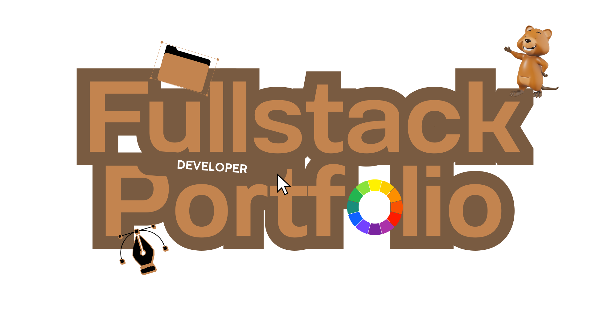
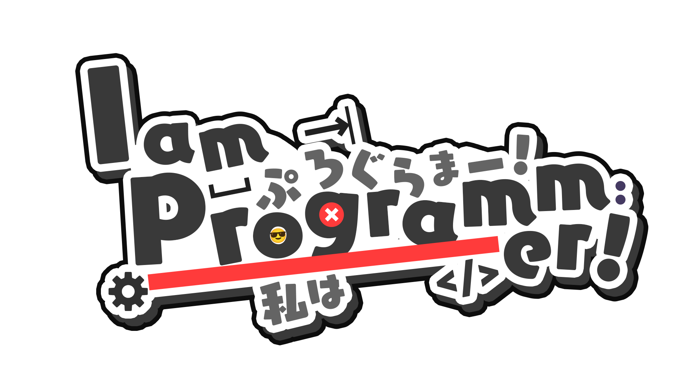
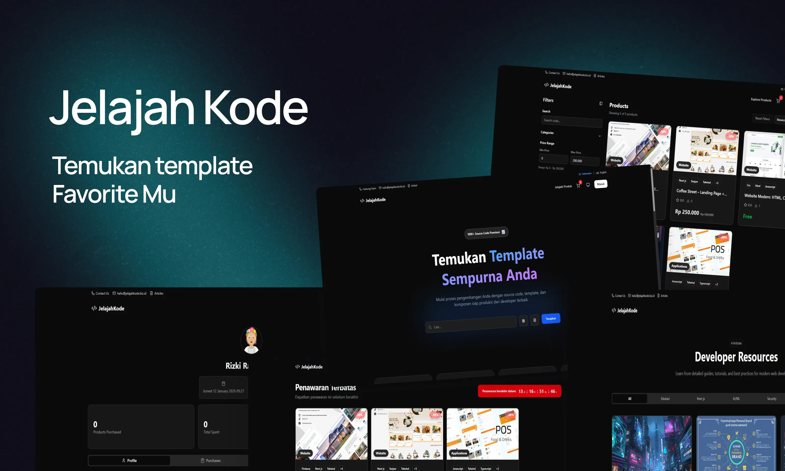
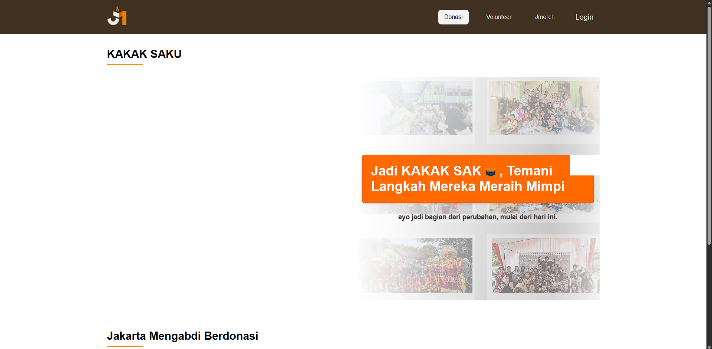
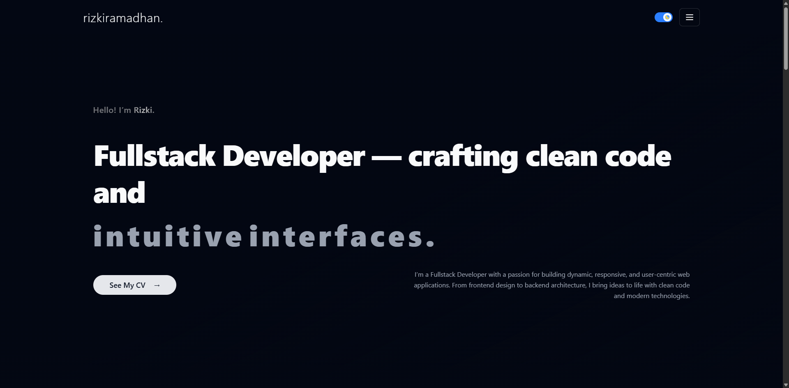
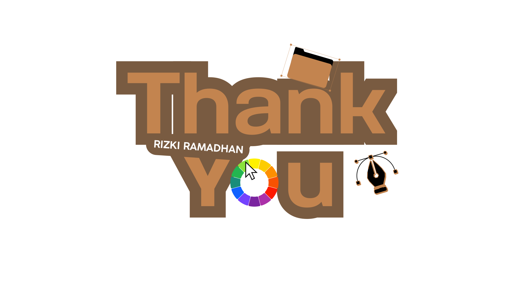

<p align="center">
  
</p>

<div align="center">
  <h1>Rizki Ramadhan</h1>
  <p>
    Fullstack Developer from Indonesia — building web products, developer tools, and AI-powered experiences.
  </p>

  <p>
    <a href="https://github.com/rzkir">
      
    </a>
    <a href="https://linkedin.com/in/rizki-ramadhan12">
      
    </a>
    <a href="mailto:hello@rizkiramadhan.web.id">
      
    </a>
  </p>

  <p>
    
  </p>
</div>

---

## About

- **Role**: Fullstack Developer
- **Focus**: SaaS, AI, performance, clean architecture
- **Stack**: React / Next.js / Vue / Nuxt / React Native, Node.js, Laravel, PostgreSQL, Supabase, Rust

<details>
<summary><b>Quick snapshot</b></summary>

```ts
export const rizki = {
  role: "Fullstack Developer",
  location: "Indonesia",
  interests: ["AI", "Developer Tools", "SaaS"],
  frontend: ["React", "Next.js", "Vue", "Nuxt"],
  backend: ["Node.js", "Laravel", "PHP"],
  data: ["PostgreSQL", "Supabase", "Firebase"],
  mobile: ["React Native"],
  systems: ["Rust"],
} as const;
```

</details>

## Tech Stack

<p align="center">
  
</p>

## GitHub

<p align="center">
  
  
</p>

<p align="center">
  
</p>

## Featured Projects

- **Rizki AI** — AI platform for building and shipping AI-powered experiences.  
  - **Live**: [rizkiramadhan.web.id](https://rizkiramadhan.web.id)  
  - <details>
    <summary><b>Preview</b></summary>
    <br />
    
    </details>

- **Kodera** — Template marketplace for fast project kickstarts.  
  - **Live**: [kodera.biz.id](https://kodera.biz.id)  
  - <details>
    <summary><b>Preview</b></summary>
    <br />
    
    </details>

- **Jakarta Mengabdi** — Donation platform to support community initiatives.  
  - **Live**: [kakasaku.jakartamengabdi.com](https://kakasaku.jakartamengabdi.com)  
  - <details>
    <summary><b>Preview</b></summary>
    <br />
    
    </details>

- **Portfolio** — Personal website & selected works.  
  - **Live**: [rizkiramadhan.biz.id](https://rizkiramadhan.biz.id/)  
  - <details>
    <summary><b>Preview</b></summary>
    <br />
    
    </details>

## Now

- **Building**: scalable SaaS products
- **Exploring**: AI and developer tooling
- **Optimizing**: performance and DX
- **Contributing**: open source when possible

<p align="center">
  
</p>

<p align="center">
  
</p>
